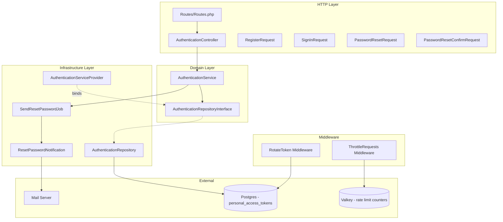

# Design Document: JWT Authentication

## Overview

This design implements token-based authentication for the Trocado API using Laravel Sanctum's opaque token system. Despite the spec name "jwt-authentication", the implementation uses Sanctum's cryptographically random opaque tokens (not JWTs) — stored as SHA-256 hashes in Postgres. The feature lives under `app/Features/Authentication/` following the vertical slice architecture.

Key behaviors:
- Registration, sign-in, sign-out (single device), log-out (all devices), password reset
- Transparent periodic token rotation via middleware (every 7 days, within a DB transaction)
- 30-day token expiration enforced via Sanctum's `expiration` config
- Unified error envelope transformation in `bootstrap/app.php` (project-wide)
- Rate limiting via Laravel's `RateLimiter` facade + `ThrottleRequests` middleware

### Design Decisions

| Decision | Choice | Rationale |
|----------|--------|-----------|
| Token expiration | Sanctum `expiration` config (43200 min = 30 days) | Built-in; no custom column needed. The `expires_at` column already exists in the migration but Sanctum's `expiration` config takes precedence per docs. |
| Token rotation | Custom `RotateToken` middleware | Transparent to all authenticated endpoints; checks `created_at` age, generates new token, deletes old in a transaction, sets `X-New-Token` header. |
| Deactivated account detection | Check for soft-deleted users with anonymized email pattern (`deleted_*@anonymized.local`) | Allows distinguishing "no account" from "deactivated account" without revealing which case applies to unauthenticated callers. |
| Error envelope | Exception handler in `bootstrap/app.php` | Project-wide, not Authentication-specific; transforms all ≥400 responses into `{errors:[{field,message,code}]}`. |
| Rate limiters | Defined in `AuthenticationServiceProvider::boot()` | Authentication-specific rate limits live with the Authentication feature; global rate limits would go in `AppServiceProvider`. |
| Password reset | Laravel's built-in password broker + custom notification | Reuses proven token generation/validation; custom `ResetPasswordNotification` for PT-BR email template. |
| Password reset job dispatch | After-commit dispatch | Valkey can't enlist in Postgres transactions; follows project convention. |

## Architecture



### Request Flows

**Registration / Sign-In:**
```
POST /api/auth/register → ThrottleRequests → AuthenticationController::register
  → AuthenticationService::register() → create User → create token → 201 {token, user}

POST /api/auth/sign-in → ThrottleRequests → AuthenticationController::signIn
  → AuthenticationService::signIn() → verify credentials → create token → 200 {token}
```

**Authenticated Requests (any endpoint):**
```
GET /api/expenses → RotateToken middleware
  → if token.created_at > 7 days: DB::transaction { delete old, create new, set X-New-Token }
  → if token.created_at > 30 days: 401
  → proceed to controller
```

**Password Reset:**
```
POST /api/auth/password/request → ThrottleRequests → AuthenticationController::requestPasswordReset
  → AuthenticationService::requestPasswordReset() → dispatch SendResetPasswordJob (after commit)
  → 200 {} (always, regardless of email existence)

POST /api/auth/password/reset → ThrottleRequests → AuthenticationController::resetPassword
  → AuthenticationService::resetPassword() → validate token → update password → delete all tokens
  → 200 {}
```

## Components and Interfaces

### File Structure

```
app/Features/Authentication/
├── Domain/
│   ├── Contracts/
│   │   └── AuthenticationRepositoryInterface.php
│   ├── Notifications/
│   │   └── ResetPasswordNotification.php
│   ├── Jobs/
│   │   └── SendResetPasswordJob.php
│   └── Services/
│       └── AuthenticationService.php
├── Http/
│   ├── Controllers/
│   │   └── AuthenticationController.php
│   ├── Middleware/
│   │   └── RotateToken.php
│   ├── Requests/
│   │   ├── RegisterRequest.php
│   │   ├── SignInRequest.php
│   │   ├── PasswordResetRequest.php
│   │   └── PasswordResetConfirmRequest.php
│   └── Routes/
│       └── Routes.php
└── Infrastructure/
    ├── Providers/
    │   └── AuthenticationServiceProvider.php
    └── Repositories/
        └── AuthenticationRepository.php
```

### Interfaces

```php
interface AuthenticationRepositoryInterface
{
    public function findActiveUserByEmail(string $email): ?User;
    public function findUserIncludingTrashed(string $email): ?User;
    public function createUser(array $data): User;
    public function createToken(User $user, string $name = 'api'): NewAccessToken;
    public function deleteToken(PersonalAccessToken $token): void;
    public function deleteAllTokens(User $user): void;
    public function rotateToken(PersonalAccessToken $oldToken, User $user): NewAccessToken;
}
```

### AuthenticationService

Responsibilities:
- `register(array $data): array` — Create user, issue token, return `{token, user}`
- `signIn(string $email, string $password): array` — Verify credentials, issue token, return `{token}`
- `signOut(User $user, PersonalAccessToken $token): void` — Delete current token
- `logOut(User $user): void` — Delete all user tokens
- `requestPasswordReset(string $email): void` — Dispatch reset email job if user exists
- `resetPassword(string $uid, string $token, string $newPassword): void` — Validate reset token, update password, revoke all tokens

### RotateToken Middleware

```php
class RotateToken
{
    public function handle(Request $request, Closure $next): Response
    {
        $response = $next($request);

        $token = $request->user()?->currentAccessToken();
        if (!$token instanceof PersonalAccessToken) {
            return $response;
        }

        $sevenDaysAgo = now()->subDays(7);
        if ($token->created_at->isAfter($sevenDaysAgo)) {
            return $response;
        }

        // Rotate within a transaction
        $newToken = DB::transaction(function () use ($token, $request) {
            $token->delete();
            return $request->user()->createToken('api', expiresAt: now()->addDays(30));
        });

        $response->headers->set('X-New-Token', $newToken->plainTextToken);

        return $response;
    }
}
```

### AuthenticationController (slim)

Each method: inject validated request → delegate to AuthenticationService → return response.

```php
class AuthenticationController
{
    public function __construct(private readonly AuthenticationService $service) {}

    public function register(RegisterRequest $request): JsonResponse { /* 201 */ }
    public function signIn(SignInRequest $request): JsonResponse { /* 200 */ }
    public function signOut(Request $request): JsonResponse { /* 204 */ }
    public function logOut(Request $request): JsonResponse { /* 204 */ }
    public function requestPasswordReset(PasswordResetRequest $request): JsonResponse { /* 200 */ }
    public function resetPassword(PasswordResetConfirmRequest $request): JsonResponse { /* 200 */ }
}
```

### Error Envelope Transformation

Implemented in `bootstrap/app.php` as exception renderer customization:

```php
->withExceptions(function (Exceptions $exceptions): void {
    $exceptions->shouldRenderJsonWhen(
        fn (Request $request) => $request->is('api/*'),
    );

    $exceptions->render(function (Throwable $e, Request $request) {
        if (!$request->is('api/*')) {
            return null; // Let default handler manage non-API
        }
        // Transform ValidationException, AuthenticationException,
        // ThrottleRequestsException, etc. into error envelope format
    });
})
```

### Rate Limiters

Defined in `AuthenticationServiceProvider::boot()`:

```php
RateLimiter::for('auth-sign-in', function (Request $request) {
    return Limit::perMinute(5)->by($request->ip());
});

RateLimiter::for('auth-password-reset', function (Request $request) {
    return Limit::perHour(3)->by($request->ip());
});
```

### Routes

```php
// Public (no auth required)
Route::prefix('auth')->group(function () {
    Route::post('/register', [AuthenticationController::class, 'register']);
    Route::post('/sign-in', [AuthenticationController::class, 'signIn'])
        ->middleware('throttle:auth-sign-in');
    Route::post('/password/request', [AuthenticationController::class, 'requestPasswordReset'])
        ->middleware('throttle:auth-password-reset');
    Route::post('/password/reset', [AuthenticationController::class, 'resetPassword'])
        ->middleware('throttle:auth-password-reset');

    // Authenticated
    Route::middleware('auth:sanctum')->group(function () {
        Route::post('/sign-out', [AuthenticationController::class, 'signOut']);
        Route::post('/logout', [AuthenticationController::class, 'logOut']);
    });
});
```

### Sanctum Configuration Changes

```php
// config/sanctum.php
'expiration' => 43200, // 30 days in minutes
```

### Privacy & Telemetry

Sensitive data scrubbing is configured in `bootstrap/app.php` via Laravel's exception handler `dontReport` and custom `context()` stripping, or via a dedicated middleware/error reporting config. Fields excluded from error reporting:

- Headers: `Authorization`, `Cookie`, `X-Forwarded-For`, `X-Real-IP`, `Forwarded`
- Body fields: `password`, `password_confirmation`, `new_password`, `current_password`, `token`
- Server vars: `REMOTE_ADDR`, `HTTP_X_FORWARDED_FOR`

## Data Models

### personal_access_tokens (existing — no schema changes needed)

| Column | Type | Notes |
|--------|------|-------|
| id | bigint PK | Auto-increment |
| tokenable_type | string | `App\Features\Users\Domain\Models\User` |
| tokenable_id | bigint | FK to users.id |
| name | text | Token name (`'api'`) |
| token | string(64) | SHA-256 hash (unique index) |
| abilities | text nullable | JSON abilities array |
| last_used_at | timestamp nullable | Updated on each request by Sanctum |
| expires_at | timestamp nullable | Set to `now() + 30 days` at creation |
| created_at | timestamp | Used by rotation middleware to determine age |
| updated_at | timestamp | Standard Eloquent |

The `expires_at` column already exists in the Sanctum migration. We use BOTH:
- `config/sanctum.php` `expiration` = 43200 (global fallback)
- Explicit `expires_at` set at token creation (per-token precision)

Sanctum checks both; `expires_at` takes precedence if set.

### users (existing — no schema changes needed)

The User model already has `email`, `name`, `password`, `email_verified_at`, soft deletes will be added separately. For deactivated account detection, we check for the anonymized email pattern (`deleted_*@anonymized.local`) on soft-deleted records.

### password_reset_tokens (Laravel built-in)

| Column | Type | Notes |
|--------|------|-------|
| email | string PK | User email |
| token | string | Hashed reset token |
| created_at | timestamp nullable | For expiry checking |

This table is created by Laravel's default migration (`0001_01_01_000000_create_users_table.php` typically includes it).


## Correctness Properties

*A property is a characteristic or behavior that should hold true across all valid executions of a system — essentially, a formal statement about what the system should do. Properties serve as the bridge between human-readable specifications and machine-verifiable correctness guarantees.*

### Property 1: Registration round-trip

*For any* valid email (RFC 5322), name (1–128 chars), and password (≥8 chars), registering a user SHALL return a 201 response containing a non-empty token string and a user object with `id`, `email`, and `name` fields matching the input.

**Validates: Requirements 1.1**

### Property 2: Duplicate email rejection

*For any* already-registered active user, attempting to register again with the same email SHALL return a 422 response with error code `email_already_registered`.

**Validates: Requirements 1.2**

### Property 3: Password minimum length enforcement

*For any* string shorter than 8 characters used as a password in registration or password reset confirmation, the Auth_System SHALL reject the request with error code `password_weak`.

**Validates: Requirements 1.4, 7.3**

### Property 4: Password never stored in plaintext

*For any* registration request with a valid password, the value stored in the `password` column of the `users` table SHALL NOT equal the plaintext password provided in the request.

**Validates: Requirements 1.5**

### Property 5: Registration validation rejects invalid input

*For any* registration request where one or more required fields (email, name, password) are missing, empty, malformed (non-RFC5322 email), or exceed limits (name > 128 chars), the Auth_System SHALL return a 422 response with an error envelope identifying each invalid field.

**Validates: Requirements 1.6, 1.7**

### Property 6: Sign-in round-trip

*For any* registered user with known email and password, a sign-in request with those credentials SHALL return a 200 response containing a non-empty token string that can be used to authenticate subsequent requests.

**Validates: Requirements 2.1**

### Property 7: Sign-in failure indistinguishability

*For any* sign-in attempt that fails (non-existent email, wrong password, or soft-deleted user), the Auth_System SHALL return an identical 401 response structure with error code `invalid_credentials` and `field: null`, regardless of which condition caused the failure.

**Validates: Requirements 2.2**

### Property 8: Token rotation threshold

*For any* authenticated request, the RotateToken middleware SHALL include an `X-New-Token` header if and only if the current token's `created_at` is more than 7 days in the past (and the token is not yet expired). When no rotation occurs, the `X-New-Token` header SHALL be absent.

**Validates: Requirements 3.1, 3.2**

### Property 9: Rotation preserves request processing

*For any* authenticated request where token rotation occurs, the response body SHALL be identical to what it would have been without rotation — only the `X-New-Token` header is added.

**Validates: Requirements 3.4**

### Property 10: Expired or invalid token rejection

*For any* bearer token that is expired (older than 30 days) or does not correspond to any record in `personal_access_tokens`, the Auth_System SHALL return a 401 response with error code `invalid_credentials`.

**Validates: Requirements 3.5, 8.6**

### Property 11: Sign-out invalidates exactly the current token

*For any* authenticated user holding multiple valid tokens, signing out with one specific token SHALL invalidate only that token; the remaining tokens SHALL continue to authenticate successfully.

**Validates: Requirements 4.1**

### Property 12: Log-out invalidates all user tokens

*For any* authenticated user holding N valid tokens (N ≥ 1), logging out via any one of them SHALL invalidate all N tokens, and subsequent requests with any of those tokens SHALL return 401.

**Validates: Requirements 5.1**

### Property 13: Password reset non-enumeration

*For any* email address (whether it belongs to an existing user, a non-existent user, or a deactivated user), a password reset request SHALL return an identical 200 response with body `{}`.

**Validates: Requirements 6.1**

### Property 14: Password reset job conditional dispatch

*For any* password reset request where the email belongs to an existing active user, a `SendResetPasswordJob` SHALL be dispatched; for any email that does not belong to an active user, no job SHALL be dispatched.

**Validates: Requirements 6.2**

### Property 15: Password reset confirmation round-trip

*For any* user with a valid password reset token and a new password of ≥8 characters, confirming the reset SHALL: (a) update the user's password so that sign-in works with the new password, (b) invalidate all existing access tokens for that user, and (c) consume the reset token so it cannot be reused.

**Validates: Requirements 7.1**

### Property 16: Invalid reset token rejection

*For any* password reset confirmation attempt with a token that is invalid, expired, already consumed, or associated with a non-existent uid, the Auth_System SHALL return a 400 response with error code `reset_token_invalid`.

**Validates: Requirements 7.2, 7.4**

### Property 17: Token expiration set to exactly 30 days

*For any* token issued by the Auth_System (via registration, sign-in, or rotation), the `expires_at` timestamp SHALL be exactly 30 days (2,592,000 seconds) after the moment of issuance, within a tolerance of ±2 seconds.

**Validates: Requirements 8.1**

### Property 18: Token stored as SHA-256 hash only

*For any* token issued by the Auth_System, the `token` column in `personal_access_tokens` SHALL contain a 64-character hexadecimal string (the SHA-256 hash) that does not equal the plaintext token returned to the client.

**Validates: Requirements 8.3**

### Property 19: Unified error envelope format

*For any* response with HTTP status ≥ 400 from any Authentication endpoint, the response body SHALL follow the structure `{errors: [{field, message, code}]}` where: `code` is a string from the defined set of stable error codes, `field` is a string naming the offending field (for validation errors) or `null` (for non-field errors), and `message` is a non-empty string.

**Validates: Requirements 9.1, 9.2, 9.3**

### Property 20: Rate limit response format

*For any* request that exceeds a rate limit, the Auth_System SHALL return: (a) HTTP 429 status, (b) a response body following the Error_Envelope with code `throttled`, (c) a `Retry-After` header containing a positive integer, and (d) `X-RateLimit-Limit` and `X-RateLimit-Remaining` headers with correct integer values.

**Validates: Requirements 11.1, 11.2, 11.4**

## Error Handling

### Error Code Registry

| Code | HTTP Status | Field | Trigger |
|------|-------------|-------|---------|
| `email_already_registered` | 422 | `email` | Registration with existing active email |
| `email_belongs_to_deactivated` | 422 | `email` | Registration with deactivated account email |
| `password_weak` | 422 | `password` / `new_password` | Password < 8 chars |
| `invalid_credentials` | 401 | `null` | Bad sign-in, expired token, invalid token |
| `reset_token_invalid` | 400 | `null` | Bad/expired/consumed reset token or invalid uid |
| `throttled` | 429 | `null` | Rate limit exceeded |
| `field_required` | 422 | `<field_name>` | Missing required field |

### Exception Handling Strategy

The unified error envelope is implemented in `bootstrap/app.php` via `$exceptions->render(...)`:

1. **`ValidationException`** → 422: Transform Laravel's `$errors->messages()` into the envelope format. Collapse multiple messages per field into one entry joined by "; ".
2. **`AuthenticationException`** (Laravel's built-in) → 401: Return `{errors: [{field: null, message: "...", code: "invalid_credentials"}]}`.
3. **`ThrottleRequestsException`** → 429: Return envelope with `throttled` code. Set `Retry-After` header from exception's `retryAfter` property.
4. **`HttpException` (general)** → Map status to appropriate code. Use framework codes for non-auth errors (`not_found`, `server_error`, etc.).
5. **Unhandled exceptions** → 500: Return `{errors: [{field: null, message: "Ocorreu um erro interno.", code: "server_error"}]}`. Log full stack trace; never expose internals to client.

### Error Message Language

All user-facing error messages are written in PT-BR, second person ("você"). The `code` field is the stable contract for client localization — messages are informational and may change between releases.

### Sensitive Data Protection

Before forwarding exceptions to error reporting services (e.g., Sentry), the following are redacted:
- Headers: `Authorization`, `Cookie`, `X-Forwarded-For`, `X-Real-IP`, `Forwarded`
- Body fields: `password`, `password_confirmation`, `new_password`, `current_password`, `token`
- Server variables: `REMOTE_ADDR`, `HTTP_X_FORWARDED_FOR`

## Testing Strategy

### Approach

This feature uses a **dual testing approach**:
- **Property-based tests** (via [Pest Plugin Quickcheck](https://github.com/mateffy/pest-plugin-quickcheck) or a custom Pest helper using Faker for generation) to verify universal properties across many generated inputs
- **Example-based feature tests** (Pest + `RefreshDatabase`) for specific scenarios, integration flows, edge cases, and rate limit threshold behavior

### Property-Based Testing Configuration

- **Library**: Custom Pest helper leveraging `Faker` for input generation within a `repeat($n, fn)` loop, or a Pest PBT plugin if available
- **Minimum iterations**: 100 per property test
- **Tag format**: `// Feature: jwt-authentication, Property {N}: {title}`
- Each correctness property maps to exactly one property-based test

### Test Organization

```
tests/
├── Feature/Authentication/
│   ├── RegistrationTest.php        (Properties 1-5, examples for 1.3)
│   ├── SignInTest.php               (Properties 6-7, examples for rate limits)
│   ├── TokenRotationTest.php        (Properties 8-10)
│   ├── SignOutTest.php              (Property 11)
│   ├── LogOutTest.php              (Property 12)
│   ├── PasswordResetTest.php       (Properties 13-16)
│   ├── TokenCharacteristicsTest.php (Properties 17-18)
│   ├── ErrorEnvelopeTest.php       (Property 19)
│   └── RateLimitTest.php           (Property 20, examples for thresholds)
└── Unit/Authentication/
    └── AuthenticationServiceTest.php (Unit tests with mocked repository)
```

### Example-Based Tests (complement properties)

- Rate limit thresholds (5/min sign-in, 3/hour password reset) — exact threshold verification
- Deactivated account detection (specific setup scenario)
- Password reset email content format
- Multiple validation errors collapsed into single entry
- Token rotation atomicity (verify transaction behavior)

### What Is NOT Property Tested

- Rate limit exact thresholds (EXAMPLE — specific counts)
- Telemetry/privacy redaction (SMOKE — config verification)
- Token randomness entropy (SMOKE — Sanctum default)
- Error message language (SMOKE — manual review)
- Job idempotency (INTEGRATION — infrastructure concern)
- Proxy IP detection (INTEGRATION — network config)
